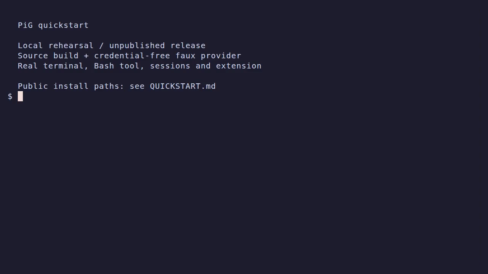

<!--
SPDX-FileCopyrightText: Copyright Hewlett Packard Enterprise Development LP
SPDX-License-Identifier: MIT
-->

# PiG quickstart

**Local rehearsal, not a public-release installation demo.** This guide uses a source build and PiG's deterministic faux provider. Model answers are fixed test responses. The terminal, Bash tool execution, saved sessions, and extension are real. No model credentials are required.

PiG is a faithful Go implementation of [Pi](https://github.com/earendil-works/pi), the reference implementation ([Pi documentation](https://pi.dev/docs/latest)). Michael Kinsy created PiG, which was originally developed at Hewlett Packard Enterprise. PiG is not an official Pi project and does not imply endorsement by Pi's maintainers.

[Watch the tutorial](media/quickstart/quickstart.mp4) · [GIF](media/quickstart/quickstart.gif) · [Recording and verification](media/quickstart/README.md)

[](media/quickstart/quickstart.mp4)

## 1. Build from an existing checkout

Use Linux for the verified commands below. Use the Go toolchain declared in [`go.mod`](go.mod). This guide does not install toolchains or fetch a checkout.

From the repository root:

```bash
go build -o /tmp/qs-bin/pig ./cmd/pig
/tmp/qs-bin/pig --version
```

The build exits 0 without output. The version command prints this captured result:

```text
0.2.0+0.87.1
```

This is an observed build identity, not a version to hard-code into scripts. PiG prints its own release followed by the Pi pin as build metadata ([D63](DIVERGENCES.md#d63---version-prints-pigs-composite-version)). The pin comes from [`coding/pigversion/pigversion.go`](coding/pigversion/pigversion.go).

### Public installation paths: unavailable in this verification

These are actual failed checks, not commands used by the recording. No curl or Git shim substitutes a local artifact for a public release. They were checked on 2026-09-25 before the rehearsal was restricted to existing tools and local fixtures.

The website installer command is:

```bash
curl -fsSL https://pi-in-go.dev/install.sh | sh
```

Captured output:

```text
curl: (22) The requested URL returned error: 502
curl: (22) The requested URL returned error: 502
curl: (22) The requested URL returned error: 404
pig-install: error: no PiG release is published yet (https://pi-in-go.dev/api/latest-version did not answer); build from source or set PIG_VERSION
```

The outer curl exits 0. The shell running the installer exits 1. Both pipeline statuses were checked; a successful download of `install.sh` is not a successful installation. PiG's hosted URLs differ from Pi's ([D64](DIVERGENCES.md#d64-pigs-hosted-endpoints-live-on-pi-in-godev)). The checked-in installer requires release checksums before installing a binary.

The public Go module command is:

```bash
go install github.com/MichaelKinsy/PiG/cmd/pig@latest
```

It exits 1. Captured output from the isolated HOME:

```text
go: github.com/MichaelKinsy/PiG/cmd/pig@latest: module github.com/MichaelKinsy/PiG/cmd/pig: git ls-remote -q --end-of-options https://github.com/MichaelKinsy/PiG in /tmp/qs-home/go/pkg/mod/cache/vcs/9d47e502db7c27b18ec964fbe6606adc03eaa74776941419a7a06fc5d9b5f9a7: exit status 128:
	fatal: could not read Username for 'https://github.com': terminal prompts disabled
Confirm the import path was entered correctly.
If this is a private repository, see https://go.dev/doc/faq#git_https for additional information.
```

The public repository/module was not anonymously accessible in this check. A successful public installation is not verified. Use the existing source checkout for this rehearsal.

## 2. Use an isolated HOME and select the faux model

Run this in a separate terminal after the build. Use an unused disposable HOME if `/tmp/qs-home` already contains work you need. The setup commands are silent on success.

```bash
mkdir -p /tmp/qs-home/demo
env -i HOME=/tmp/qs-home \
  PATH="/tmp/qs-bin:$(go env GOROOT)/bin:/usr/bin:/bin" \
  GOPROXY=off GOTOOLCHAIN=local PIG_TEST_FAUX=1 PIG_OFFLINE=1 \
  bash --noprofile --norc
```

This shell inherits no credentials or PiG configuration overrides. It resolves the existing Go executable before changing HOME, so a version-manager shim cannot install another toolchain. PiG stores this rehearsal's state under `/tmp/qs-home/.pig`, not your normal HOME. PiG uses `.pig` rather than Pi's `.pi` ([D2](DIVERGENCES.md#d2-pig-uses-a-separate-command-and-configuration-identity)). HOME separation is not a security sandbox for tools or extensions.

In that shell:

```bash
cd ~/demo
pig --tui-mode fullscreen --model test-faux/faux-1
```

The screen includes:

```text
Ready. Type a message and press Enter (or Shift+Enter for newline). Ctrl+O toggles all tool details.
Ctrl+D to exit.
```

The footer identifies `faux-1`. This recording explicitly selects fullscreen mode; regular mode remains the default. Fullscreen also keeps the VHS screen assertions within its visible terminal buffer. The explicit `--model` flag selects the test provider; do not use `/model` to search for this harness-only model. If `rg` or `fd` is absent from PATH, offline startup reports that it skips their downloads. Neither is needed for the arithmetic tool call below.

For live model selection and authentication, read the [provider guide](internal/pigdocs/content/providers.md). This rehearsal does not exercise login, Radius, or any remote model service. The faux provider is not a general-purpose model.

## 3. Ask a question and run a tool

Type this in PiG and press Enter:

```text
What is 20+22?
```

The faux provider replies:

```text
42
```

Then submit:

```text
Run: expr 20 + 22
```

The faux provider requests a real Bash tool call. The tool card contains this captured output:

```text
$ expr 20 + 22

42

Took 0.0s
```

The final assistant response is `42`. The elapsed time varies. The exact `Run:` phrase is a faux-provider trigger, not a requirement for live models. The [local verifier](media/quickstart/verify-local.py) also checks the JSON tool-start arguments, matching tool-call ID, successful tool-end event, and exact `42\n` tool result.

## 4. Resume the saved conversation

Submit each command separately:

```text
/name Quickstart
/new
/resume
```

`/new` reports `✓ New session started`. `/resume` opens `Resume Session (Current Folder)` and lists `Quickstart`. Select that row and press Enter. The earlier question, Bash tool result, and answer reappear.

Submit:

```text
reply with exactly: Resumed.
```

The response is:

```text
Resumed.
```

Press Ctrl+D on an empty editor to leave PiG. The recording verifies the restored tool card before it sends the continuation prompt. Sessions remain in the disposable HOME.

## 5. Print one answer and exit

At the shell prompt:

```bash
pig --model test-faux/faux-1 -p "What is 20+22?"
```

Output, exit 0:

```text
42
```

## 6. Load an extension explicitly

Keep using the isolated shell in `~/demo`. Scaffold a Go extension with PiG's bundled SDK; no package installation is involved:

```bash
pig extension init ./hello --lang go
```

Captured output:

```text
Created go extension "hello" in /tmp/qs-home/demo/hello
  go.mod
  extension.go

SDK: /tmp/qs-home/.pig/state/pigsdk/sdk

Next steps:
  pig install /tmp/qs-home/demo/hello --validate-only --json
  pig -e /tmp/qs-home/demo/hello          # load it into a session, then edit and /reload
```

The `Next steps` lines above are PiG's output, not additional commands run by this guide. Run the extension through an explicit path:

```bash
pig -e ./hello --tui-mode fullscreen --model test-faux/faux-1
```

The status line says `hello loaded`. Submit `/hello`. The notification says `hello from hello`. Press Ctrl+D to exit. Only load extension code you trust; it runs with your permissions. PiG's Go subprocess SDK is an additive capability ([D19](docs/additive-features.md#d19-multi-language-subprocess-sdk-bridges)).

## 7. Check update ownership

Run:

```bash
pig update
```

For the source-built `/tmp/qs-bin/pig`, output is:

```text
pig cannot self-update this installation. Executable: /tmp/qs-bin/pig. Reinstall it with the package manager, wrapper, or source checkout that provided it, or download a new pig binary from your provider's releases.
```

Exit status is 1. The verifier confirms the executable's SHA-256 is unchanged. This is an expected ownership refusal, not a successful update. Rebuild source installations with the command in step 1. PiG's native update ownership differs from Pi's package-manager self-update ([D39](DIVERGENCES.md#d39-standalone-binary-self-update)). Do not fabricate an installation receipt or redirect the updater to a fixture to make this step appear successful.

See [recording evidence and limitations](media/quickstart/README.md) for the reproducible local checks and media constraints.
