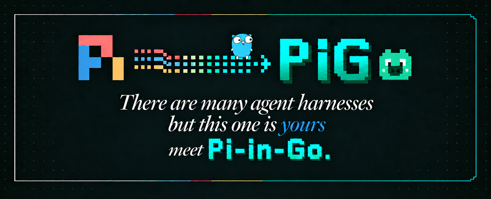

<!--
SPDX-FileCopyrightText: Copyright Hewlett Packard Enterprise Development LP
SPDX-License-Identifier: MIT
-->

<p align="center">
  
</p>

# PiG

[](https://github.com/MichaelKinsy/PiG/actions/workflows/ci.yml)
[](https://github.com/MichaelKinsy/PiG/actions/workflows/security.yml)
[](https://scorecard.dev/viewer/?uri=github.com/MichaelKinsy/PiG)
<!-- TODO(owner): add the OpenSSF Best Practices badge after registering at https://www.bestpractices.dev; replace PROJECT_ID with the assigned id.
[](https://www.bestpractices.dev/projects/PROJECT_ID)
-->
[](https://api.reuse.software/info/github.com/MichaelKinsy/PiG)
[](https://goreportcard.com/report/github.com/MichaelKinsy/PiG)
[](https://pkg.go.dev/github.com/MichaelKinsy/PiG)
[](go.mod)
[](LICENSE)
[](https://github.com/MichaelKinsy/PiG/releases)
[](https://github.com/earendil-works/pi/releases/tag/v0.87.1)
[](parity/coverage.md)
[](https://x.com/PiGCodingAgent)
[](https://www.reddit.com/r/PiGCodingAgent/)

<!-- BEGIN PORTING -->
<!-- Generated by `make coverage`. Do not hand-edit. -->
**Porting:** 446 of 542 intended-portable upstream files are ported (82.3%). The 542 are the [`PORT_MAP.md`](PORT_MAP.md) rows for Pi's `agent`, `ai`, `coding-agent`, and `tui` packages, excluding 74 `n/a` and 0 deferred rows. Of the other 96, 24 are partial and 72 are not started. Not started includes 23 files new in Pi 0.87.1 that PiG has not ported yet.

**Behavioral evidence badge:** 428 of the 446 ported files (96.0%) have a behavioral paired scenario or reviewed mutation-proven unit test. The badge counts evidence mappings, not passing runs; [`parity/coverage.md`](parity/coverage.md) shows the last recorded run.
<!-- END PORTING -->

PiG (Pi in Go) is a Go implementation of [Pi](https://github.com/earendil-works/pi), the TypeScript codebase behind the Pi coding agent. PiG is a parity-bound translation, where Pi's behavior is the contract and Go is the implementation language.

PiG is under active development. Windows support is a preview.

## Install

macOS and Linux:

```bash
curl -fsSL https://pi-in-go.dev/install.sh | sh
```

Windows (PowerShell):

```powershell
irm https://pi-in-go.dev/install.ps1 | iex
```

npm, on any supported platform:

```bash
npm install -g @pi-in-go/pig
```

Go:

```bash
go install github.com/MichaelKinsy/PiG/cmd/pig@latest
```

You can also download an archive for your platform from [GitHub Releases](https://github.com/MichaelKinsy/PiG/releases) or [build from source](#build-from-source). [pi-in-go.dev/install](https://pi-in-go.dev/install) covers every method, with update and uninstall steps. Then run `pig` in a project directory.

## Upstream Pi

Pi is the reference implementation. PiG follows Pi's behavior and design unless a Go constraint or an approved product-neutral requirement makes a difference necessary.

Use the upstream project for Pi itself:

- [Pi source](https://github.com/earendil-works/pi)
- [Pi documentation](https://pi.dev/docs/latest)
- [Earendil Works](https://github.com/earendil-works)
- [Pi community](https://discord.com/invite/3cU7Bz4UPx)

PiG is not an official Pi release. The Pi maintainers do not endorse PiG.

## Origins

Michael Kinsy created PiG working at Hewlett Packard Enterprise.

PiG is maintained as an independent open-source project. Project decisions, issues, and contributions belong in this repository. See [GOVERNANCE.md](GOVERNANCE.md) and [MAINTAINERS.md](MAINTAINERS.md).

## Compatibility philosophy

PiG adds a Go implementation to the Pi ecosystem and follows the Pi reference implementation.

- Preserve observable compatibility with Pi.
- Treat the pinned Pi release as the reference behavior.
- Minimize unnecessary divergence.
- Record each intentional user-visible or interoperability difference.
- Prefer changes that reduce the cost of the next upstream sync.
- Share generally useful findings with the broader ecosystem when the contribution route permits it.

The pinned Pi release is 0.87.1 at commit `f07218c4d4bbc12bef056a7058c3dd49dfe41abe`. The pin names the behavior oracle. It does not claim that every upstream change is already ported: [`parity/coverage.md`](parity/coverage.md) reports verified behavior, and the upgrade ledgers under [`parity/upstream-sync/`](parity/upstream-sync/) list each upstream change and its disposition.

PiG's current package scope covers Pi's agent, AI, coding-agent, and TUI
packages. It does not implement Pi's experimental remote Session packages or
its standalone telemetry and evaluation packages. See
[`PORT_MAP.md`](PORT_MAP.md) for the exact boundary.

## Project facts

- Binary: `pig`
- Go module: `github.com/MichaelKinsy/PiG`
- Configuration root: `~/.pig/`, or `PIG_HOME`
- Agent directory: `~/.pig/agent`, or `PIG_CODING_AGENT_DIR`
- Pi version pin: [`coding/pigversion/pigversion.go`](coding/pigversion/pigversion.go)
- Local upstream mirror: `.upstream/current/`
- Main verification gate: `make check`
- Full verification and coverage refresh: `make verify`

`pig --version` prints PiG's version as `<PiG release>+<Pi release>`, for example `0.2.0+0.87.1` (D63): the Pi release is semver build metadata, so the version sorts as the PiG release. `pig version` prints the PiG release and the pinned Pi release as separate fields. Neither command reads user configuration.

## Repository map

| Path          | Responsibility                                                                     |
| ------------- | ---------------------------------------------------------------------------------- |
| `agent/`      | Pi-compatible Agent loop, messages, and harness Session state.                     |
| `ai/`         | Pi-compatible providers, model catalog, authentication, and streaming types.       |
| `coding/`     | Public coding-agent SDK, extension contracts, Package support, and Piglet support. |
| `tui/`        | Public terminal components, rendering, input, and terminal lifecycle.              |
| `cmd/pig/`    | Stock PiG command-line application and RPC process surface.                        |
| `internal/`   | Private implementation used by Stock PiG. External modules cannot import it.       |
| `extensions/` | Go, Rust, Python, and declaration-only TypeScript extension SDKs.                  |
| `piglets/`    | Explicit agent compositions such as PiG Standard and Pig Porter.                   |
| `parity/`     | Pinned Pi correspondence, scenarios, inventories, and generated evidence.          |
| `tests/`      | Integration, extension-conformance, clean-repository, and upstream-contract tests. |
| `docs/`       | Maintainer references and the static public documentation site.                    |
| `examples/`   | Small extension and embedding examples.                                            |
| `automation/` | Reproducible CI image definitions.                                                 |
| `scripts/`    | Checked development, parity, and release-support commands.                         |

PiG aligns public package boundaries with Pi's `agent`, `ai`, `coding-agent`,
and `tui` packages. Go files within a package follow cohesive implementation
responsibilities instead of mirroring TypeScript file mechanics. `PORT_MAP.md`
records every source correspondence.

## Stock PiG and compositions

Stock PiG is the product-neutral binary built from this repository. It does not
activate PiG Standard Resources, product authentication, product APIs, or
deployment-specific behavior.

A Piglet explicitly selects Resources, tools, discovery, defaults, and environment requirements for one agent. A Package distributes Resources. A Package never owns or activates a Piglet. A Piglet Binary is a direct executable build output for one pinned Piglet composition.

PiG Standard is the explicit Piglet at
[`piglets/standard/pig-standard.yaml`](piglets/standard/pig-standard.yaml).
It currently selects the extension-provided PiG login, sprite catalogue, and
PiG Runner. Run it from source with:

```bash
pig --piglet piglets/standard/pig-standard.yaml
```

Stock PiG never selects this composition implicitly. A Package can distribute
its Resources, but a Package cannot own or activate the Piglet.

See [CONTEXT.md](docs/project/CONTEXT.md) and [docs/README.md](docs/README.md) for the project terms and documentation map.

## Security boundary

PiG runs with the permissions of the user who starts it. PiG does not provide a security sandbox for model output, tools, extensions, skills, hooks, or shell commands.

Use a container, virtual machine, or another operating-system boundary when you need isolation. Load extensions and project instructions only from sources you trust. See [SECURITY.md](SECURITY.md).

## Install with npm

Install the command with npm (Node.js 18 or newer):

```bash
npm install -g @pi-in-go/pig
pig --version
```

Or run it once without installing:

```bash
npx @pi-in-go/pig --version
```

`pig` itself is the native binary: npm installs the matching platform package
(`@pi-in-go/pig-<os>-<cpu>`, for macOS, Linux and Windows on x64 and arm64) as
an optional dependency, and Node.js runs only a small launcher. Do not install
with `--omit=optional` or `--no-optional`, which leaves the binary out. Update
with `npm update -g @pi-in-go/pig` and uninstall with
`npm uninstall -g @pi-in-go/pig`. `pig update` does not replace an
npm-installed binary; update through npm.

## Install with Go

Install the command without a source checkout with Go 1.26 or newer:

```bash
go install github.com/MichaelKinsy/PiG/cmd/pig@latest
```

Go writes the `pig` executable to `GOBIN`, or to the `bin` directory of the first
`GOPATH` entry when `GOBIN` is unset: `$(go env GOPATH)/bin`, which is
`~/go/bin` by default (`%USERPROFILE%\go\bin` on Windows). Add that directory to
`PATH`. With an older Go 1.21 or later and the default `GOTOOLCHAIN=auto`, Go
downloads a new enough toolchain automatically. Release binaries are built with
Go 1.27.1.

Use an exact release such as `@v0.2.0` when reproducibility matters. Update a Go
installation by running `go install` again. Each release tags the root module
(`v0.2.0`) and the Go extension SDK module (`extensions/sdk/v0.2.0`) on the same
commit; `go install` needs both.

## Build from source

PiG currently supports source builds on Linux, macOS, and Windows. Do not treat a platform as release-supported until its native release verification passes.

Requirements:

- Go 1.27.1
- Git
- macOS 13 or later for native macOS builds
- Node.js 24.19.0 and npm 12.0.2 for parity tooling
- Python 3.12 for Python SDK tests
- Rust 1.97.1 for Rust SDK tests
- tmux for terminal parity tests on Unix

Build the binary:

```bash
go build -o bin/pig ./cmd/pig
./bin/pig --version
```

Prepare the exact Pi comparator and source mirror:

```bash
make upstream-mirror
```

Run the main local gate:

```bash
make check
```

The `upstream-mirror` target installs the lockfile-pinned Pi package. It retrieves the exact tagged Pi source and verifies its commit against [`coding/pigversion/pigversion.go`](coding/pigversion/pigversion.go).

## Contract model

- `.upstream/current/` is the local source-language mirror.
- Go code is the target implementation.
- [`PORT_MAP.md`](PORT_MAP.md) maps tracked upstream files.
- `parity/scenarios/` records observed behavior.
- [`parity/coverage.md`](parity/coverage.md) reports generated verification status.
- [`DIVERGENCES.md`](DIVERGENCES.md) records intentional differences.
- [`AGENTS.md`](AGENTS.md) defines maintenance rules.
- [`Makefile`](Makefile) defines build, test, parity, and release gates.

A ported row means that code exists. It does not prove behavioral compatibility. A non-deferred scenario must exercise and assert the mapped behavior.

## Extensions

PiG supports Go, Rust, Python, and Node extension factories through its public extension host. Extensions can register tools, commands, event handlers, flags, shortcuts, providers, and user-interface contributions.

Node extensions use Pi's TypeScript extension API. PiG supplies compatible
runtime modules. The declaration-only package in `extensions/sdk-ts` adds types
for PiG-only extension capabilities without replacing Pi's TypeScript runtime.

Start with:

- [Extension authoring](docs/extension-authoring.md)
- [Extension API parity](docs/extension-api-parity.md)
- [Extension runtime cells](docs/extension-runtime-cells.md)

Use `pig extension init <directory>` to scaffold an extension. Use `pig install <path> --validate-only --json` to validate it.

## Supply-chain evidence

PiG treats scanner output as evidence input, not as proof by itself. Release preparation builds a validated dependency inventory and artifact-specific SPDX SBOMs. Reviewers reconcile scanner findings with Go modules, npm locks, Python metadata, Rust locks, embedded assets, generated data, and release contents.

See [docs/supply-chain.md](docs/supply-chain.md) for the inventory, SBOM, vulnerability, license, signing, and provenance requirements.

## Project policies

- Read [CONTRIBUTING.md](CONTRIBUTING.md) before proposing a change.
- Read [SECURITY.md](SECURITY.md) before reporting a vulnerability.
- Read [SUPPORT.md](SUPPORT.md) before requesting support.
- Read [GOVERNANCE.md](GOVERNANCE.md) and [MAINTAINERS.md](MAINTAINERS.md) for project ownership.
- Read [LICENSE](LICENSE), [NOTICE](NOTICE), and [THIRD_PARTY_NOTICES.md](THIRD_PARTY_NOTICES.md) for licensing and attribution.

## Acknowledgements

PiG would not exist without Pi and the work of its maintainers and contributors. Their design and open-source work provide the reference that PiG follows.

Thank you to everyone who contributes to Pi and PiG.
